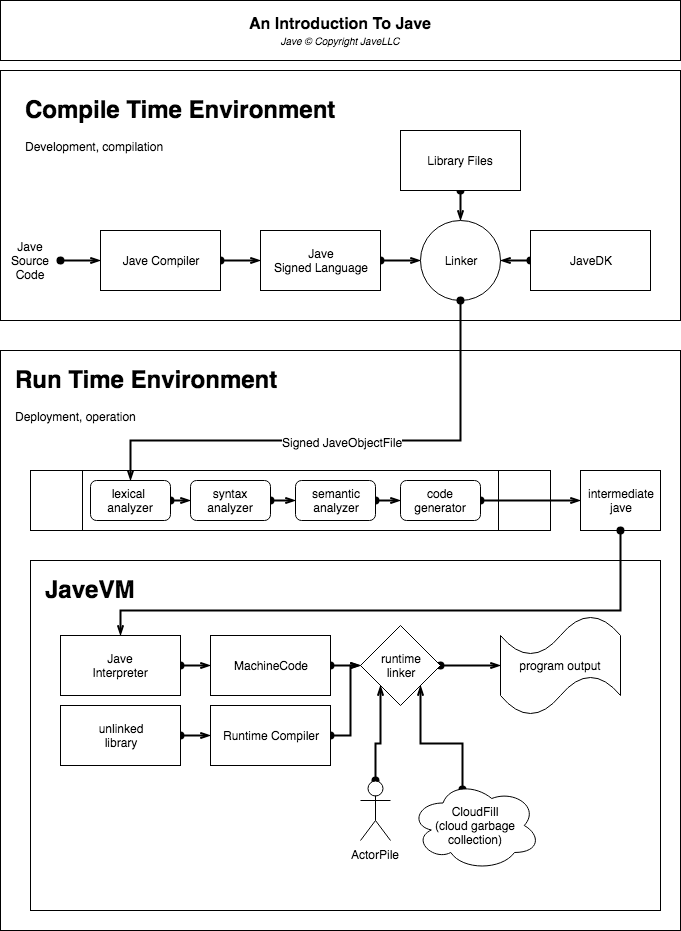

# Jave Language
From the Orca's blowhole, Jave is born. Jave is an open source compiled and interpreted language that makes it exceptionally difficult to build complex, unreliable, and inefficent software.

## Introduction
Jave, inspired by decades of technological process, seeks to utilize only the most intelligent, inspired, and significant processes in order to acquire completion of tasks at the speediest and most resiliant rate.

## Compiled or Interpreted?
Both! Would you believe it?
Due to innovations in Jave's framework, you write in raw Jave, which is then compiled into Signed Jave Intermediary language, a language you cannot write yourself but must be compiled by a licensed Jave compiler. This is then interpreted server-side, then delivered into the JaveVM for final compilation, linking, and operation.

## Documentation
[Official Documentation](https://github.com/JaveLLC/jave/wiki) Is available.

## Example
- Coming soon

## Contributing
Jave is the work of very few contributors. We appreciate your lack of help!

You can onboard to become a contributor by checking out [Contributing Guidelines](https://github.com/JaveLLC/jave/wiki/Contributing).

## Contributors
- None

## License

MIT [license](LICENSE) it is.
